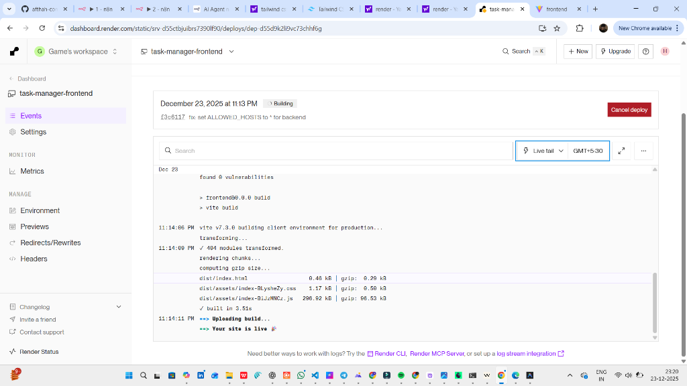

# Task Manager App

A full-stack Task Manager application built with Django (Backend) and React (Frontend).

## Features
- User Authentication (Login/Register) using JWT.
- Create, Read, Update, Delete (CRUD) tasks.
- Mark tasks as complete/incomplete.
- Filter tasks (All, Completed, Pending).
- Search tasks.
- Dark/Light Mode support.
- Responsive UI.

## Tech Stack
- **Frontend**: React, Vite, Axios, React Router, Vanilla CSS.
- **Backend**: Python, Django, Rest Framework, SimpleJWT, SQLite (default).

## Setup Instructions

### Prerequisites
- Python 3.8+
- Node.js 14+

### Backend Setup
1. Navigate to the backend directory:
   ```bash
   cd backend
   ```
2. Create virtual environment and install dependencies:
   ```bash
   python -m venv venv
   # Windows
   .\venv\Scripts\activate
   # Linux/Mac
   source venv/bin/activate
   
   pip install -r requirements.txt
   ```
3. Run migrations:
   ```bash
   python manage.py migrate
   ```
4. Start the server:
   ```bash
   python manage.py runserver
   ```
   Server will run at `http://127.0.0.1:8000/`.

### Frontend Setup
1. Navigate to the frontend directory:
   ```bash
   cd frontend
   ```
2. Install dependencies:
   ```bash
   npm install
   ```
3. Start the development server:
   ```bash
   npm run dev
   ```
   App will run at `http://localhost:5173/`.

## API Endpoints
- `POST /api/auth/register/`: Register new user.
- `POST /api/auth/login/`: Login.
- `GET/POST /api/tasks/`: List or Create tasks.
- `GET/PUT/PATCH/DELETE /api/tasks/{id}/`: Manage specific task.

## Screenshots

*(App is live and deployed on Render)*
